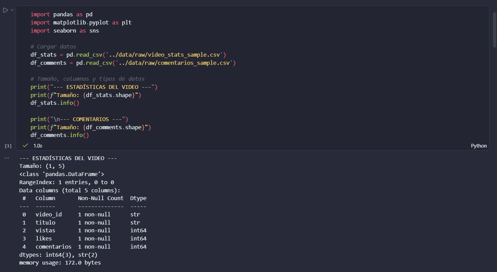
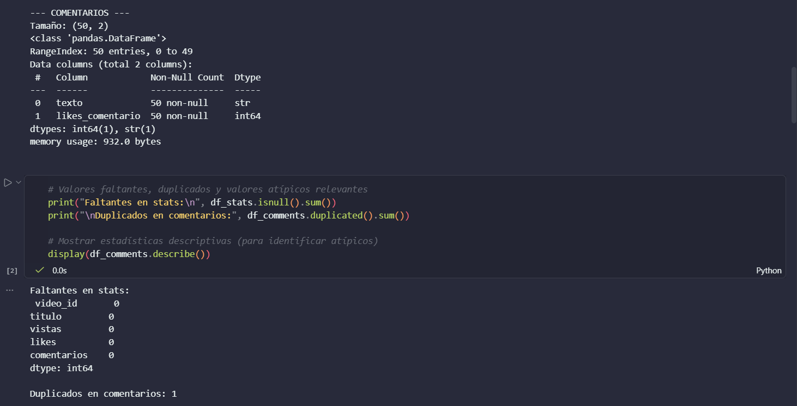
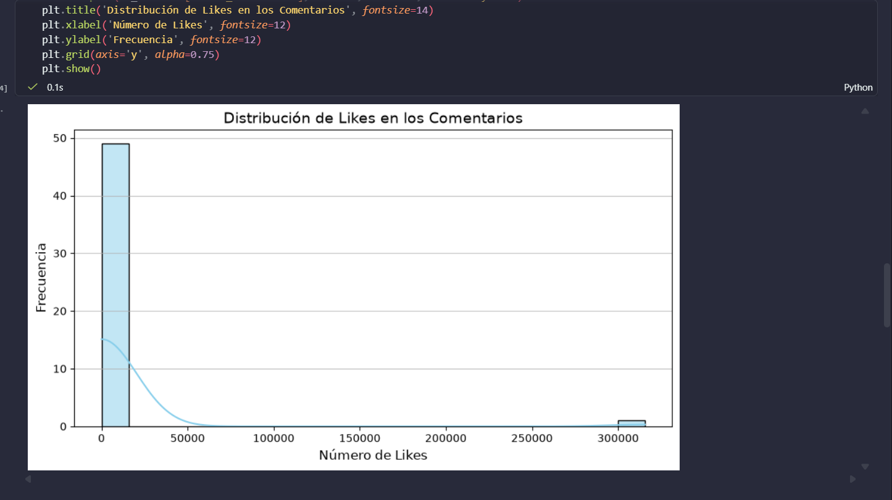
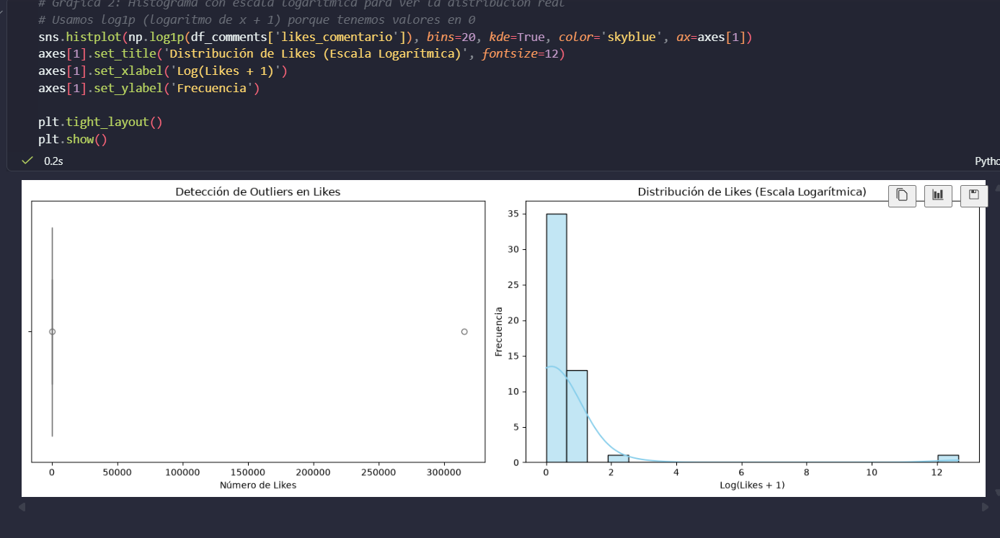
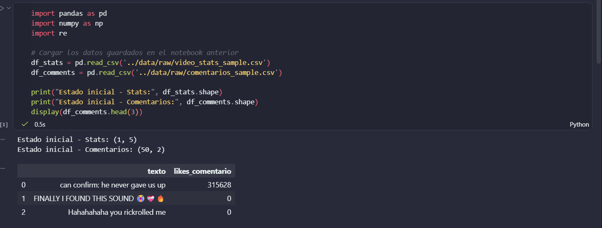
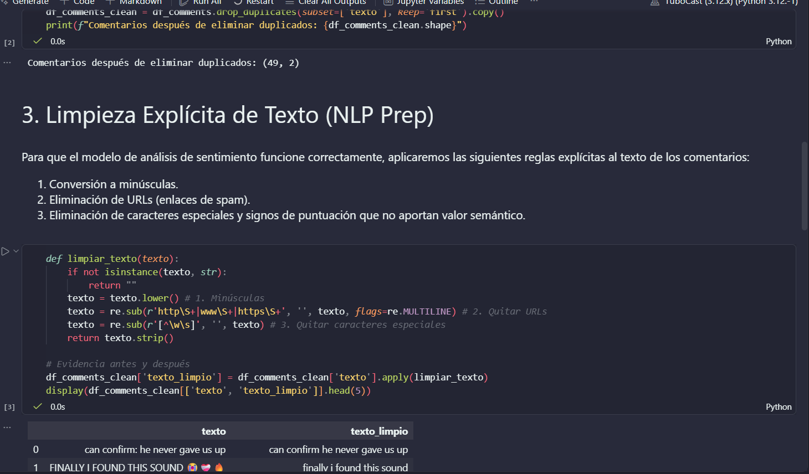

# TuboCast: Predicción de Viralidad en YouTube

**Integrantes:**
* [Tu Nombre Aquí] - Diego Eduardo Martinez Sincel *(O los nombres de tu equipo)*

## 1. Descripción del Problema y Resultado Esperado
Predecir qué videos ganarán tracción en YouTube es un desafío complejo. Este proyecto aborda el problema combinando métricas tempranas de rendimiento con Análisis de Sentimiento (NLP) aplicado a los comentarios. El resultado esperado es un modelo predictivo (series de tiempo con variables exógenas) que estime el crecimiento a corto plazo de las visualizaciones y determine si el tono de la audiencia acelera la popularidad de un video.

## 2. Origen de los Datos
* **Fuente original:** [YouTube Data API v3](https://developers.google.com/youtube/v3)
* **Documentación del dataset:** Puedes consultar las justificaciones de la muestra, el diccionario de datos y las consideraciones de privacidad en nuestro [data/README.md](data/README.md).

## 3. Estructura del Repositorio
```text
├── data/                  # Datos crudos locales (ignorados en Git) y README del dataset
├── informe/               # Documento inicial de planteamiento (informe-final.ipynb)
├── notebooks/             # Entornos interactivos
│   ├── 01-eda.ipynb               # Análisis exploratorio y evaluación de métricas
│   └── 02-preparacion-datos.ipynb # Limpieza de texto y manejo de outliers
├── .env.example           # Plantilla de variables de entorno
├── .gitignore             # Exclusión de credenciales y datos masivos
├── pyproject.toml         # Configuración del proyecto y dependencias
├── uv.lock                # Bloqueo estricto de versiones para reproducibilidad
└── README.md              # Documentación principal
```

## 6. Evidencia de Ejecución

A continuación se presenta la evidencia de la ejecución exitosa de los notebooks en un entorno limpio y sincronizado:

### Análisis Exploratorio de Datos (01-eda.ipynb)






### Preparación de Datos (02-preparacion-datos.ipynb)


