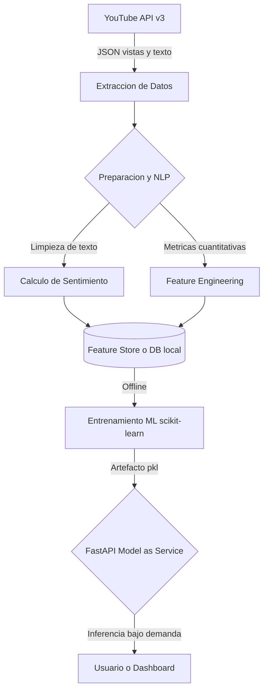

# Mapa del Sistema de Machine Learning: TuboCast

## 1. Contexto
* **Evidencia del EDA:** Observamos que la cantidad de visualizaciones tempranas y el volumen de comentarios son capturables en tiempo real y varían drásticamente entre videos.
* **Decisión inicial:** El sistema apoyará la decisión de creadores de contenido y agencias de marketing sobre qué videos promocionar o monetizar más agresivamente tras su publicación.
* **Supuesto:** Asumimos que la respuesta inicial del público (primeras horas) dicta el rendimiento a mediano plazo del video.
* **Pregunta pendiente:** ¿Es el sentimiento de los comentarios un factor más determinante que el simple volumen de "likes"?

## 2. Nivel de datos
* **Evidencia del EDA:** La variable objetivo (`viewCount`) es fuertemente asimétrica (right-skewed). La limpieza de texto es obligatoria debido al spam (detectamos comentarios duplicados y outliers masivos de likes).
* **Decisión inicial:** 
  * **Fuentes:** YouTube Data API v3.
  * **Unidad de observación:** Un video de YouTube en el momento $t_0$ (ej. 24h tras publicación).
  * **Target:** Logaritmo natural de visualizaciones futuras (ej. a las 72h).
  * **Features candidatas:** `likes_count` inicial, `comments_count` inicial, `sentiment_score` agregado.
* **Supuesto:** Los comentarios extraídos son representativos de la audiencia real y no predominantemente de bots.
* **Pregunta pendiente:** ¿Cuál es la estrategia óptima de entrenamiento/prueba temporal para evitar predecir con videos que sufrieron cambios de algoritmo en el pasado?

## 3. Nivel del modelo
* **Evidencia del EDA:** La asimetría de los datos sugiere que los modelos lineales simples podrían fallar sin transformaciones, haciendo atractivos los modelos basados en árboles.
* **Decisión inicial:** 
  * **Tarea ML:** Regresión de series de tiempo con variables exógenas (NLP).
  * **Baseline:** Modelo de media móvil simple o regresión lineal básica (solo con vistas previas, sin sentimiento).
  * **Artefacto:** Un pipeline serializado (`.pkl` o `.joblib`) que incluya el preprocesamiento de texto y el regresor.
* **Supuesto:** El sentimiento cualitativo aporta una ganancia medible (reducción del error) sobre el baseline puramente cuantitativo.
* **Pregunta pendiente:** ¿Nuestra métrica inicial será el Error Cuadrático Medio (RMSE) o el Error Absoluto Medio (MAE)? ¿Cuál será el criterio de aceptación del negocio para considerar el modelo útil?

## 4. Nivel de código
* **Evidencia del EDA:** El procesamiento de lenguaje natural requiere limpieza exhaustiva mediante expresiones regulares y tokenización.
* **Decisión inicial:** 
  * **Componentes:** Script de extracción (API Client), Módulo de limpieza NLP, Entrenador de modelos, API consumidora (FastAPI).
  * **Dependencias:** `uv` para gestión, `pandas`, `scikit-learn`, `requests`, `fastapi`.
* **Supuesto:** Los recursos locales del equipo son suficientes para entrenar los modelos base sin necesidad de cómputo distribuido.
* **Pregunta pendiente:** ¿Qué modelo de HuggingFace o librería (`nltk`/`vader`) investigaremos y configuraremos para puntuar el sentimiento en español de manera rápida?

## 5. Interfaces
* **Evidencia del EDA:** Los datos llegan en JSON anidados desde YouTube y deben aplanarse a estructuras tabulares (DataFrames) antes del modelado.
* **Decisión inicial (Contratos):**
  1. **Datos a Modelo:** Matriz de features con esquema estricto: `[video_id: str, likes: int, comments: int, avg_sentiment: float]`.
  2. **Formato del Artefacto:** Archivo `pipeline_tubocast.pkl` cargado al inicio de la aplicación para evitar latencia en disco.
  3. **Contrato de la API:** Endpoint `POST /predict`. 
     * Input JSON: `{"video_id": "str"}`
     * Output JSON: `{"predicted_views_72h": int, "viral_probability": float}`
* **Supuesto:** La API de YouTube no cambiará el formato de su JSON de respuesta en el corto plazo.
* **Pregunta pendiente:** ¿Se integrará un caché (Redis) entre las interfaces para no consultar repetidamente el mismo video?

## 6. Forma de operación
* **Evidencia del EDA:** El volumen de datos procesados (textos) requiere tiempo de ejecución que afectaría a un entrenamiento en tiempo real.
* **Decisión inicial:**
  * **Entrenamiento:** *Offline* (por lotes/batch). Justificación: El comportamiento de la viralidad no cambia radicalmente día a día, por lo que reentrenar semanal o mensualmente es suficiente.
  * **Inferencia:** *Bajo demanda*. Justificación: El usuario necesita predecir el futuro de un video específico al momento de consultarlo en el sistema.
* **Supuesto:** El tiempo de inferencia del pipeline (limpiar texto + modelo ML) será menor a 1 segundo para satisfacer la solicitud web.
* **Pregunta pendiente:** ¿Cuándo se activará el reentrenamiento offline? (¿Por calendario o por caída de rendimiento?).

## 7. Patrón de serving
* **Evidencia del EDA:** Integrar el preprocesamiento de NLP junto con la app de usuario final requeriría instalar dependencias muy pesadas (PyTorch/Transformers) en el cliente.
* **Decisión inicial:** Elegimos **Model-as-Service**. 
  * *Comparación:* "Precompute" no sirve porque no conocemos los videos futuros. "Model-as-Dependency" engordaría la aplicación consumidora innecesariamente. "Model-as-Service" nos permite encapsular el modelo complejo detrás de una API REST ágil (FastAPI) y escalar el servidor de ML de forma independiente.
* **Supuesto:** La latencia de red al consultar el "Model-as-Service" será aceptable para el usuario final.
* **Pregunta pendiente:** ¿Dónde se alojará el servicio (Render, AWS, Heroku) en fases posteriores?

## 8. Diagrama
